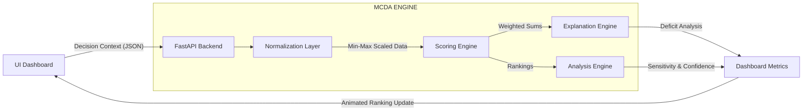

# Universal Decision Companion – A Transparent Multi-Criteria Framework

## 1. Problem Understanding
Decisions like comparing job offers, buying a laptop, or picking a tech stack are often made with gut feelings or messy spreadsheets. This system functions as a **Universal Multi-Criteria Decision Framework**. It isn't just a basic app—it is a deeply contextual engine capable of evaluating *any* multi-dimensional scenario using weighted matrices. 

## Supported Decision Domains (Templates Built-In)
The system algorithm is fully abstracted, meaning it supports any numeric decision path without hardcoded variables. Examples built directly into the UI include:
*   **Job Offer Selection**: Evaluates Base Salary, Commute Time, Growth Potential, and Culture.
*   **Laptop Purchase**: Evaluates Price, Performance, Battery Life, and Weight.
*   **Travel Destination**: Evaluates Flight Cost, Weather Score, Safety, and Activities.
*   **Enterprise Scaling**: Can easily be configured ad-hoc to evaluate Vendor Selection, Cloud Providers, or Hiring Candidates.

## 2. Assumptions
*   Criteria weights typically map to a relative scale (e.g., summing to 1.0 or 100).
*   Users provide numerical values for the evaluated options.
*   At least 2 options are required for meaningful ranking.
*   Criteria types must be explicitly defined as "benefit" (higher is better) or "cost" (lower is better).

## 3. Detailed Architecture & Decision Lifecycle
The DecisionCompanion follows a sophisticated multi-stage pipeline designed for both mathematical rigor and human interpretability.

### System-Wide Flow (Mermaid)

### The 4-Stage Lifecycle:
1.  **Context Injection**: The user defines a decision domain (e.g., "Choosing a Tech Stack"). Constraints, criteria, and relative weights are bundled into a `Decision Context`.
2.  **Normalization Tier**: The engine sanitizes raw numerical data. It automatically differentiates between **Benefit Criteria** (Price ↑ = Score ↑) and **Cost Criteria** (Price ↑ = Score ↓), mapping all units to a uniform 0.0–1.0 scale.
3.  **Synthesis Tier**: Weights are applied to the normalized matrix. The system uses a **Deterministic Weighted Sum Model (WSM)** to produce final rankings, ensuring zero "black-box" behavior.
4.  **Meta-Insight Tier**: Before returning results, the system executes three secondary analysis algorithms:
    *   **Deficit Analysis**: "Why specifically did Option B lose to Option A?"
    *   **Sensitivity Testing**: "If I change my preference weights by ±10%, does the winner remain the same?"
    *   **Confidence Protocol**: "Is the mathematical margin between rank 1 and 2 significant enough to be considered a 'strong' decision?"

## 4. Mathematical Justification
Why use the **Weighted Sum Model (WSM)** combined with **Min-Max Normalization**?

*   **Simplicity & Interpretability**: WSM allows users to literally trace the math (Score = Weight * Normalized Value), ensuring zero "black box" behavior.
*   **Deterministic Behavior**: The exact same inputs will perfectly yield the exact same ranks and explanations every single time, which is critical for trustworthy decision-making software.
*   **Why NOT Pure AI or ML?**: While AI is great for heuristics, it acts as a black box and requires massive training datasets. Decision companions require strict, auditable arithmetic logic.
*   **Why NOT AHP (Analytic Hierarchy Process)?**: AHP is extremely mathematically robust but often too heavy for everyday consumer scenarios due to its requirement for exhaustive pairwise comparison matrices. 

## 5. Explainability & Analysis Outputs
The system does not just spit out a final score. Our `Explanation Engine` and `Analysis Engine` execute meta-reviews on the outcomes:

*   **Why NOT Others**: Identifies exactly why a losing option lost compared to the winner (e.g., *“Compared to Dell XPS, MacBook Air was penalized by weak performance in Price”*).
*   **Conflict Detection**: Identifies objective trade-offs (e.g., *“Trade-off identified: Option A is best in Performance BUT Option B is best in Price.”*).
*   **Decision Confidence**: Analyzes the mathematical margin between rank 1 and rank 2 to declare if the decision is computationally "strong" or "weak/competitive".
*   **Sensitivity Analysis (Stability Score)**: The backend automatically loops weight variations (±10%) to see if the current #1 choice remains #1 when preferences shift, signaling robustness against uncertainty.

## 8. Real-World Decision Scenarios
The power of the **Universal Decision Companion** lies in its ability to adapt to any numeric evaluation framework. Below are documented scenarios demonstrating how users can leverage the system:

### 💼 Scenario A: Selecting a Job Offer
**Context**: You have three offers: a high-paying Big Tech role, a risky startup with equity, and a balanced agency role.
*   **Goal**: Maximize long-term career growth while maintaining a decent commute.
*   **Key Criteria**: Base Salary (Benefit), Growth Potential (Benefit), Commute Time (Cost), Culture (Benefit).
*   **System Value**: The engine identifies that while Big Tech pays 20% more, the "Startup" wins on **Stability Score** if Growth Potential is weighted above 35%.

### 💻 Scenario B: Enterprise Procurement (Laptops)
**Context**: An engineering lead needs to choose the standard fleet for a dev team.
*   **Goal**: Performance and Portability within a strict budget.
*   **Key Criteria**: Price (Cost), Performance RAM/CPU (Benefit), Battery (Benefit), Weight (Cost).
*   **System Value**: The **Deficit Analysis** reveals that the Dell XPS was penalized primarily by **Price**, making the MacBook Air the optimal choice for the current budget weight.

### ✈️ Scenario C: Travel Planning
**Context**: Choosing between Bali, Tokyo, and Rome for a 2-week vacation.
*   **Goal**: Best weather and safety within a flight budget.
*   **Key Criteria**: Flight Cost (Cost), Weather Score (Benefit), Activities (Benefit), Safety (Benefit).
*   **System Value**: The **Confidence Protocol** alerts the user when the margin between Tokyo and Bali is <5%, suggesting that the choice is "highly competitive" and may depend on subjective preference.

## 9. Local Deployment & Persistence
*   **Local Storage**: Decisions are automatically cached in the browser's `localStorage`, allowing you to close the app and return to your evaluation matrix at any time.
*   **Save/Export**: Use the "Save Scope" button to permanently name and archive a specific decision scenario in your local database.
